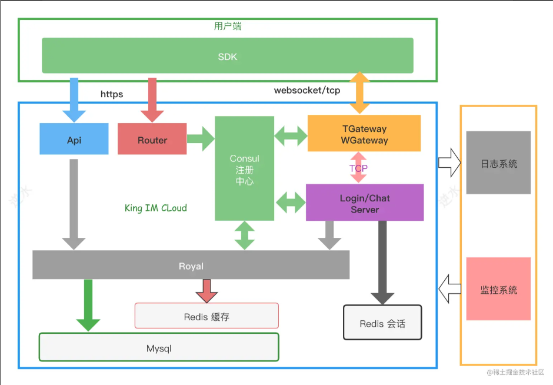
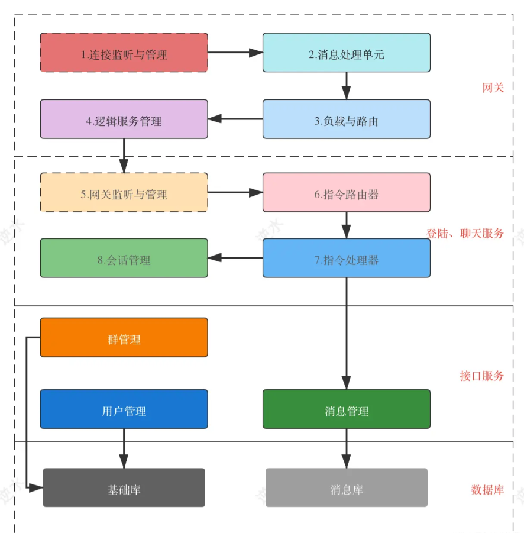
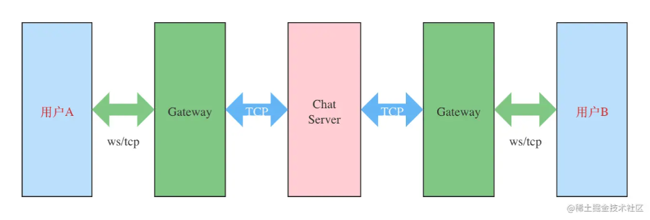
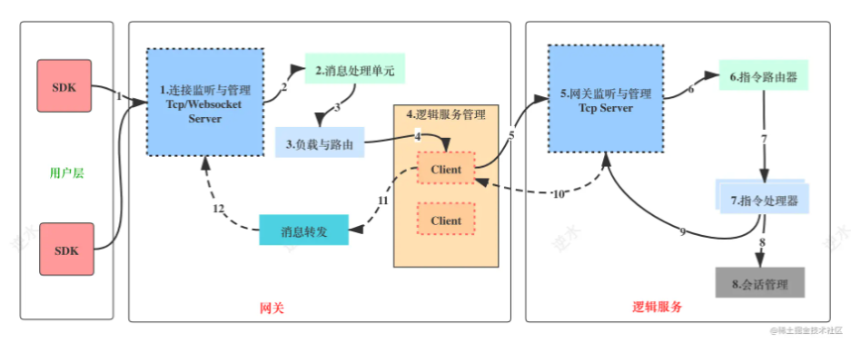

# dim
- io
- gc
- thread
- concurrency

端口监听、拨号连接、消息发送、消息接收、心跳、连接管理
tcp/websocket协议与逻辑解耦

1.心跳 ping pong 保活 检测
2.重连
3.负载均衡
4.协议 魔数常量
5.MQ缓存解决服务状态 消息中间件做服务调用 水平拓展
6.分层 网关

- 服务聚合

- 鉴权

- 限流

- 路由

- 负载均衡

  
  
  7.用户标签均衡会提高转移开销 会话分离横向拓展好,单点性能下降

其中通信相关的核心模块：

连接监听与管理：监控端口，并接收客户端的连接，维护在内存中。
消息处理单元：解析接收的消息并处理。
负载与路由：根据策略把消息发送到指定的服务中。
逻辑服务管理：维护与逻辑服务的长连接，收/发消息。
网关监听与管理：监控端口，并接收网关的连接，维护在内存中。
指令路由器：类似于Http中的路由，通过协议头中的指令找到指令处理器。
会话管理：管理系统登录的会话，会话存储在缓存Redis中。

