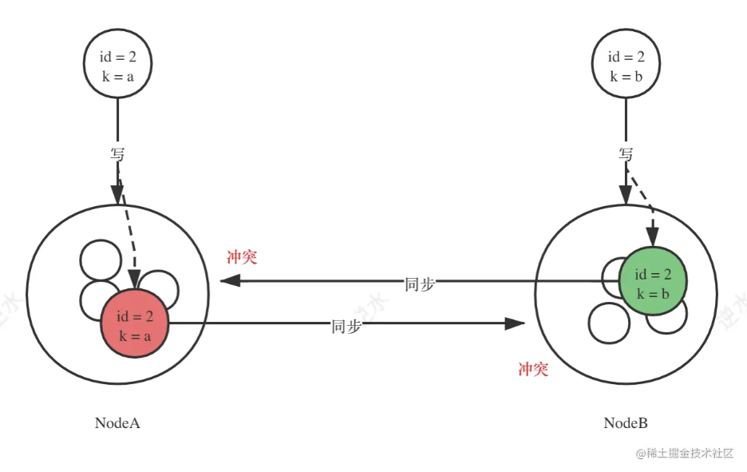
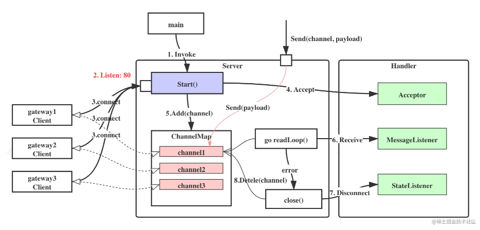
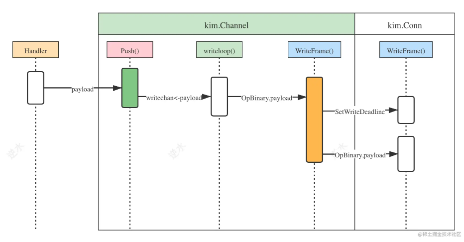
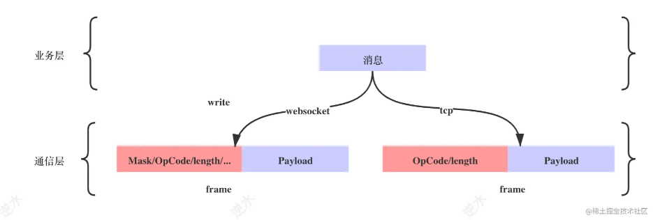

# 分布式唯一ID 
​    全局唯一， 写入数据库前确认，避免写入上锁或冲突
​    设计前期就使用分布式ID作为数据的主键，成本实际上是非常低的
​    数据库主键冲突后迁移成本高

    核心场景 消息存储
    
    - 有序性：提高数据库插入性能。利于数据库批处理IO，索引值越小,单位id内存越小，所以只考虑数字
    - 可用性：可保证高并发下的可用性。
    - 友好性：尽量简单易用，不增加系统负担。
    
    选型：
    数据库自增id 起点不同 步长相同 重构修改代价高
    分布式id服务
    雪花算法     需要保证每个计算节点编号NodeID不重复

!(./assets/image-20230519174448464.png)




# Server






```go
type Server interface {
    SetAcceptor(Acceptor)
    SetMessageListener(MessageListener)
    SetStateListener(StateListener)
    SetReadWait(time.Duration)
    SetChannelMap(ChannelMap)
    
    Start() error
    Push(string, []byte) error
    Shutdown(context.Context) error
}
```

```go
// server.go
type Acceptor interface {
    Accept(Conn, time.Duration) (string, error)
}
```

``` go
// server.go
type StateListener interface {
    Disconnect（string) error
}
```

```go
// server.go
// heart ping-pong
type SetReadWaot(time.Duation)
```

```go
// channels.go
type ChannelMap interface {
    Add(channel Channel)
    Remove(id string)
    Get(id string) (Channel, bool)
    All() []Channel
}
```

```go
// server.go
type MessageListener interface {
    Receive(Agent, []byte)
}

type Agent interface {
    ID() string
    Push([]byte) error
}
```


# Protocol



```
// server.go
type Frame interface {
	SetOpCode(OpCode)
	GetOpCode() OpCode
	SetPayload([]byte)
	GetPayload() []byte
}
```

```
// server.go
// Conn Connection
type Conn interface {
	net.Conn
	ReadFrame() (Frame, error)
	WriteFrame(OpCode, []byte) error
	Flush() error
}
```

```go
// server.go
const (
	OpContinuation OpCode = 0x0
	OpText         OpCode = 0x1
	OpBinary       OpCode = 0x2
	OpClose        OpCode = 0x8
	OpPing         OpCode = 0x9
	OpPong         OpCode = 0xa
)
```


# Client

```go
// 
type Client interface {
    ID() string
    Name() string
    Connect(string) error
    SetDialer(Dialer)
    Send([]byte) error
    Read() (Frame, error)
    Close()
}

type Dialer interface {
    DialAndHandshake(DialerContext) (net.Conn, error)
}

type DialerContext struct {
    Id string
    Name string
    Address string
    Timeout time.Duration
}
```

