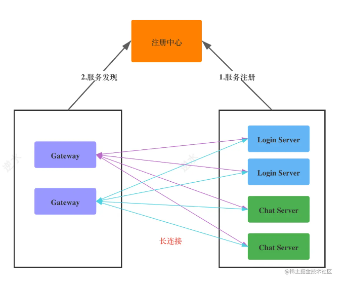

# 分布式唯一ID 
​    全局唯一， 写入数据库前确认，避免写入上锁或冲突
​    设计前期就使用分布式ID作为数据的主键，成本实际上是非常低的
​    数据库主键冲突后迁移成本高

    核心场景 消息存储
    
    - 有序性：提高数据库插入性能。利于数据库批处理IO，索引值越小,单位id内存越小，所以只考虑数字
    - 可用性：可保证高并发下的可用性。
    - 友好性：尽量简单易用，不增加系统负担。
    
    选型：
    数据库自增id 起点不同 步长相同 重构修改代价高
    分布式id服务
    雪花算法     需要保证每个计算节点编号NodeID不重复

!(./assets/image-20230519174448464.png)


# Server


```go
type Server interface {
    SetAcceptor(Acceptor)
    SetMessageListener(MessageListener)
    SetStateListener(StateListener)
    SetReadWait(time.Duration)
    SetChannelMap(ChannelMap)
    
    Start() error
    Push(string, []byte) error
    Shutdown(context.Context) error
}
```

```go
// server.go
type Acceptor interface {
    Accept(Conn, time.Duration) (string, error)
}
```

``` go
// server.go
type StateListener interface {
    Disconnect（string) error
}
```

```go
// server.go
// heart ping-pong
type SetReadWaot(time.Duation)
```

```go
// channels.go
type ChannelMap interface {
    Add(channel Channel)
    Remove(id string)
    Get(id string) (Channel, bool)
    All() []Channel
}
```

```go
// server.go
type MessageListener interface {
    Receive(Agent, []byte)
}

type Agent interface {
    ID() string
    Push([]byte) error
}
```


# Protocol


```
// server.go
type Frame interface {
	SetOpCode(OpCode)
	GetOpCode() OpCode
	SetPayload([]byte)
	GetPayload() []byte
}
```

```
// server.go
// Conn Connection
type Conn interface {
	net.Conn
	ReadFrame() (Frame, error)
	WriteFrame(OpCode, []byte) error
	Flush() error
}
```

```go
// server.go
const (
	OpContinuation OpCode = 0x0
	OpText         OpCode = 0x1
	OpBinary       OpCode = 0x2
	OpClose        OpCode = 0x8
	OpPing         OpCode = 0x9
	OpPong         OpCode = 0xa
)
```


# Client

```go
// 
type Client interface {
    ID() string
    Name() string
    Connect(string) error
    SetDialer(Dialer)
    Send([]byte) error
    Read() (Frame, error)
    Close()
}

type Dialer interface {
    DialAndHandshake(DialerContext) (net.Conn, error)
}

type DialerContext struct {
    Id string
    Name string
    Address string
    Timeout time.Duration
}
```

# 协议区分

```go
type Magic [4]byte

var (
    //逻辑协议
	MagicLogicPkt = Magic{0xc3, 0x11, 0xa3, 0x65}
    //基础协议
	MagicBasicPkt = Magic{0xc3, 0x15, 0xa7, 0x65} 
)

func Read(r io.Reader) (interface{}, error) {
	magic := wire.Magic{}
	_, err := io.ReadFull(r, magic[:])
	if err != nil {
		return nil, err
	}
	switch magic {
	case wire.MagicLogicPkt:
		p := new(LogicPkt)
		if err := p.Decode(r); err != nil {
			return nil, err
		}
		return p, nil
	case wire.MagicBasicPkt:
		p := new(BasicPkt)
		if err := p.Decode(r); err != nil {
			return nil, err
		}
		return p, nil
	default:
		return nil, errors.New("magic code is incorrect")
	}
}
```

# container


# services


通信服务tcp协议服务无法感知更加抽象的http服务，也不能使用nginx等http做反向代理，所以需要支持dns的注册中心 保证cap中的c 一致性



service  register self by service_find dns SRV

router find service by register_center


逻辑服务必须与全部网关建立连接后，才能接受网关转发过来的消息, 暂时阻塞逻辑服务保证一致性


# router


责任链模式

gateway init


server init


# login & offline


# message


